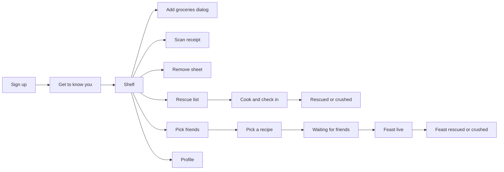

# Fridge Friends FYI: design and back-end handover

Snapshot of the living doc taken September 19, 2026. If the live doc and this file disagree, see the source-of-truth note in `README.md`.

## Overview

Fridge Friends FYI is a phone app that tracks what is in your fridge and pantry, shows each ingredient as a character whose mood reflects how long it has left, and helps you cook with friends before food goes bad.

The [design canvas](https://claude.ai/artifact/NLBaK6Vq159rkyb2vPzJVf) holds all 17 screens as a clickable prototype. This document covers what the canvas cannot show: the animations, the logic, and the back end.

The app has five areas:

- **Set up:** sign up with a user ID, password, and a buddy (an ingredient character), then a get-to-know-you page that fills in food preferences.
- **Shelf:** the landing page. Add groceries by hand or from a receipt photo, see every ingredient as a character on a shelf, and remove ones you no longer have.
- **Rescue:** recipes that use the ingredients closest to going bad, then a check-in that ends in a celebration or a crush animation.
- **Feast:** pick friends who also have ingredients to rescue, choose a group recipe, nudge them, then cook together with a shared recipe and chat.
- **Profile:** buddy, account, friends, food preferences, and a graph of money spent and food wasted over time.

All food names, prices, friend names, and dates in the canvas are sample data. Characters in the canvas are static; their motion is specified in the sections below.

## Design system

The look is a sticker style: thick dark outlines, hard offset shadows, and warm café colors. Everything below is already in the canvas files, so a dev can copy values from there.

| Token | Value | Use |
| --- | --- | --- |
| Cream | #FBF3E4 | Page background |
| Paper | #FFFDF7 | Cards, inputs, buttons (secondary) |
| Ink | #3E2A1E | Text, every outline, shadows |
| Muted | #6B5443 | Secondary text |
| Terracotta | #B4523A | Primary buttons, selected states (white text, 5.0:1 contrast) |
| Fresh chip | #DDEBD7 on #2F5A2B text | Green status |
| Use soon chip | #F8E3A9 on #5F430A text | Yellow status |
| Use now chip | #F4C7B8 on #7A2E1B text | Red status |
| Waste text | #A63A2A | Wasted amounts |
| Sage | #8FA98A | Spent and used bars, progress |
| Shelf wood | #A9744F | Shelf planks |

Character colors: milk white (#FFFFFF) with an ink outline, spinach #5DBB8A, canned tomatoes #E8674F, bell pepper #F0A03C, egg #F6D9A8, eggplant #9A62B8, salmon #F58B6E, lemon #F6D64A, cheeks #FF8FA3.

**Fonts** (Google Fonts): Fredoka 500 and 600 for headings and buttons, Nunito 400, 600, and 700 for everything else. Body text is 14 to 17 px; nothing is below 12 px.

**Components:**

- **Screen:** 390 by 844 px phone frame. Only the profile scrolls.
- **Outline:** 2.5 px ink on cards, buttons, and inputs; 2 px on chips.
- **Card:** 20 px radius, 0 4 px 0 ink shadow.
- **Primary button:** 52 px minimum height, 16 px radius, Fredoka 18 px, 0 4 px 0 ink shadow. Secondary uses Paper with ink text.
- **Chip:** pill shape, 12 px bold. Status chips always carry a word or number ("2 days"), never color alone.
- **Input:** 52 px high, 14 px radius, visible label above.
- **Preference pill:** 44 px minimum height, selected state fills Fresh green, exposed as a pressed toggle. Checkboxes (pick friends) and radios (pick a recipe) are 28 px marks with an ink outline; selected is filled terracotta with a white check.
- **Dialog:** 24 px radius, 0 6 px 0 ink shadow, dimmed page behind at 60 percent.
- **Bottom sheet:** 28 px top radius, drag handle, used for removing an ingredient.

**Accessibility:** text contrast at least 4.5:1, touch targets at least 44 px, real form labels, and every character image has a text description that includes its mood.

## Character kit

Every food is a character built from a body, colors, a face position, and a category. The category decides which moods the character goes through, so adding a new food means drawing one body and choosing its category.

| Food | Body | Category | Colors |
| --- | --- | --- | --- |
| Milk | Carton | Hard expiry | White (#FFFFFF) body and top, ink outline |
| Eggs | Egg | Hard expiry | #F6D9A8 |
| Spinach | Pointed leaf with a short stem | Gradual decline | #5DBB8A |
| Bell pepper | Pepper with stem | Gradual decline | #F0A03C |
| Canned tomatoes | Can | Shelf-stable | #E8674F body, #E8E2D4 lid |
| Pasta | Box with label | Shelf-stable | #F0C674 body, #FBF3E4 label |
| Eggplant | Eggplant with green cap and stem | Gradual decline | #9A62B8 body, #5DBB8A cap |
| Salmon | Whole fish with tail and fins | Hard expiry | #F58B6E body, #F0684A fins |
| Lemon | Lemon with a green leaf | Gradual decline | #F6D64A body, #5DBB8A leaf |

Each item has a freshness value from 0 to 1 (see Freshness logic). The character's mood is a lookup on that one number, using its category's table. The ranges below are starting values to tune with real food.

| Category | Freshness | Mood | Motion | Face |
| --- | --- | --- | --- | --- |
| Gradual decline | 75 to 100% | Happy | Gentle bob | Open eyes, smile, pink cheeks |
| Gradual decline | 50 to 75% | Uneasy | Slow blink | Eyes glance sideways, flat mouth |
| Gradual decline | 25 to 50% | Nervous | Jitter | Wide eyes, worried brows, wobbly mouth, sweat drop |
| Gradual decline | 5 to 25% | Sad and crying | Slump with sobs | Watery eyes, sad brows, wailing mouth, falling tears |
| Gradual decline | 0 to 5% | Done | None | X eyes, small open mouth |
| Hard expiry | 50 to 100% | Happy | Gentle bob | Same as above |
| Hard expiry | 20 to 50% | Uneasy | Slow blink | Same as above |
| Hard expiry | 0 to 20% | Mad and toxic | Fast shake | Angry brows, gritted teeth, green tint, rising green fumes |
| Shelf-stable | 50 to 100% | Happy, rolling | Slow roll side to side | Same as happy |
| Shelf-stable | 15 to 50% | Uneasy | Slow blink | Same as above |
| Shelf-stable | 0 to 15% | Done | None | X eyes, small open mouth |

**Color drain:** gradual and shelf-stable characters lose color as freshness falls, down to 30 percent saturation at zero. Hard-expiry characters keep full color until they turn toxic, because milk and eggs look fine until they are not.

**Eggplant on the shelf:** the canvas shows it nervous with a sweat drop, which is the 25 to 50% row.

## Motion and reactions

The canvas shows characters standing still. In the app they move, and two full-screen scenes play when a meal ends. The values below come from the interactive demo built during design (`character-demo.html`).

**Idle motions** (one per mood, looping):

| Motion | Timing | Movement |
| --- | --- | --- |
| Bob | 2.4 s | Up and down 6 px |
| Blink | 3.4 s | Eyes squash shut briefly at 94% of the loop, body breathes 2% larger |
| Jitter | 0.35 s | Shakes 2 px sideways, tilts 1.5 degrees |
| Sob | 2.6 s | Tilted 5 degrees and squashed to 93% height, two quick 3 px dips per loop |
| Rage | 0.22 s | Shakes 3 px, scaled up 3 to 4% |
| Roll | 6 s | Slides 28 px each way while turning 30 degrees, eased |

Tears fall every 1.1 s, sweat drops every 1.4 s, and toxic fumes rise every 1.8 s.

**Scene 1: Rescued.** Plays when the user taps the rescued button after a recipe or feast.

- Setting: flat sunset bands (#F2A07B, #F6C29A, #F9DDA6), a #FFD36B sun setting behind two sage hills, and confetti in the palette colors.
- Characters: the rescued ingredients with joyful closed-arc eyes, open smiles, and waving arms.
- Motion: each character hops once (0.9 s, up 28 px with squash and stretch) and 18 confetti pieces burst out over 1.2 s.
- Text: "Rescued!" for a solo meal with the dollar amount saved; "Feast rescued!" for a group meal with the count of items saved and no dollars.

**Scene 2: Crushed.** Plays when the user taps that it did not work out.

- Setting: flat dusk bands in gray-purple with a floor.
- Sequence: a heavy press with a yellow hazard stripe drops for about 0.45 s (ease-in), the ingredient flattens to 140% width and 16% height within 80 ms, the frame shakes for 0.3 s, dust puffs out both sides for 0.7 s, then the press lifts. The flattened ingredient keeps X eyes.
- Onlookers: two other ingredients watch with wide eyes, worried brows, and sweat drops.
- Text: "Oh no." for a solo meal with the amount counted as wasted; "Feast fell through" for a group meal, naming the item counted as wasted.

The canvas crushes the most urgent ingredient and lets two others watch. Which item gets crushed when several were used is an open decision below.

Build suggestion: CSS keyframes or Framer Motion in a React app cover all of this. Rive is worth considering if the team wants a single freshness value to drive each character's mood. Respect the device's reduced-motion setting by showing the static scene.

## Screens and flows

The canvas has 17 screens. Everything hangs off the shelf, and each meal ends in a celebration or a crush scene.

The shelf reaches six screens: the add dialog, the receipt scanner, the remove sheet, rescue, feast, and profile.

| Screen | What it does | Goes to |
| --- | --- | --- |
| Sign up | User ID, password, and a buddy picked from five characters with fun names (Sammy spinach, Milo milk, Eddie egg, Carl canned tomatoes, Bella bell pepper) | Get to know you |
| Get to know you | Carl asks about diet, foods to always avoid, and favorite cuisines; answers fill the profile; required, with no skip option | Shelf |
| Shelf | Header with profile avatar, count of items needing rescue, Add groceries and receipt buttons, a two-row shelf of characters with a status chip and time left, Rescue ingredients and Feast mode buttons, bottom tabs | Add dialog, scanner, remove sheet, rescue list, pick friends, profile |
| Add groceries dialog | Name, price, and date bought (today by default, editable); previews the freshness timer starting and the character assigned | Shelf |
| Scan receipt | Take photo only, no file upload; lists items found with price and a tappable category chip | Shelf |
| Remove sheet | Toss it (counts as wasted), remove because added by mistake (no record), or keep it | Shelf |
| Profile | Buddy and account, friends with invite by user ID, food preferences, weekly or monthly money and waste graph | Shelf, feast |
| Rescue list | The ingredients near the end plus recipes that use them, and an invite-friends button when that is not enough | Cook and check in, pick friends |
| Cook and check in | Recipe steps, then two buttons: rescued or did not work out | Rescued, crushed |
| Rescued | Sunset celebration, dollars saved | Shelf |
| Didn't work out | Crush scene, amount counted as wasted | Rescue list, shelf |
| Pick friends | Friends with yellow or red ingredients, each with checkboxes, plus your own | Pick a recipe |
| Pick a recipe | Three AI recipes for the group with who brings what, one selected | Waiting for friends |
| Waiting for friends | Each person's response; Start feast stays locked until everyone accepts | Feast live |
| Feast live | Shared recipe, who is bringing what, group chat, Change recipe at the top, and outcome buttons | Feast rescued, feast crushed, pick a recipe |
| Feast rescued | Sunset celebration, count of items saved | Shelf, pick friends |
| Feast didn't work out | Crush scene, item counted as wasted | Pick a recipe, shelf |

## Data model

Six records carry the whole app. Freshness, status colors, and every dashboard number are computed from them, never stored.

| Record | Key fields | Notes |
| --- | --- | --- |
| User | id, user ID (unique handle), password hash, buddy type, diets, foods to avoid, cuisines | Buddy type is one of five: spinach, milk, egg, canned tomatoes, bell pepper. The buddy's fun name comes from a fixed list. |
| Food item | id, owner, name, price, date bought, category, character type, shelf life in days, source (manual or receipt), outcome | Date bought defaults to today and is editable. Outcome is active, used, tossed, or removed. |
| Friendship | id, two user IDs, status (pending or accepted), who invited | Invites are sent by user ID only. |
| Meal | id, host, type (solo or feast), recipe snapshot, items used, status | Status runs planned, inviting, cooking, then rescued or failed. The recipe is stored as a snapshot so later changes cannot rewrite history. |
| Meal participant | meal, user, response (host, pending, accepted, declined), nudged at, items they bring | A solo meal has only the host. |
| Chat message | meal, sender, text, sent at | Feast chat only. |

**Computed values:**

- **Expiry date:** date bought plus shelf life.
- **Freshness:** 0 to 1, from the category rules in Freshness logic.
- **Status color:** green, yellow, or red from days left.
- **Spent:** sum of prices by date bought, per week or month.
- **Wasted:** sum of prices for items with outcome tossed.
- **Rescued:** sum of prices for items used in a meal with status rescued.

A removal marked "added by mistake" keeps no waste record and is excluded from spent.

## Freshness logic

When an item is added, the back end starts a timer by looking up the food's category, character, and shelf life from its name. Every mood, color, and count on screen then follows from days left.

| Category | Examples | Freshness from days left | After the date |
| --- | --- | --- | --- |
| Gradual decline | Spinach, eggplant, lemon, most produce | Days left divided by shelf life, from 1 down to 0 | Wilted food is still edible until it reaches Done, so it stays in rescue recipes |
| Hard expiry | Milk, salmon, eggs, meat | A cliff: 1.0 with more than 3 days left, 0.35 with 1 to 3 days left, 0 on the expiry date and after | Toxic and unsafe: never offered in recipes, only removal |
| Shelf-stable | Canned tomatoes, pasta | Days left divided by shelf life, so it barely moves for years | Done means past its best, so check before using |

The hard-expiry cliff is what lets the same mood table from the Character kit give happy, uneasy, and mad and toxic without a gradual fade.

**Status chips** on the shelf come from days left, not freshness:

- **Green (Fresh):** more than 5 days left.
- **Yellow (Use soon):** 3 to 5 days left.
- **Red (Use now):** 2 days or fewer.

These cutoffs are a starting rule taken from the sample shelf, where milk with 3 days is yellow and spinach with 2 days is red.

**What each color drives:**

- **"Items need rescuing" count on the shelf:** red items only.
- **Rescue list:** yellow and red items.
- **Pick friends:** any yellow or red items a friend has, whether or not they chose to show them.

The shelf life in days and the category come from a lookup table keyed by food name; the category chip on the receipt screen lets the user override it. The canvas samples are about 7 days for spinach, 10 for milk, 5 for eggplant, 12 for salmon, 3 weeks for lemon, and 2 years for canned tomatoes. The salmon figure is only a placeholder, since fresh salmon lasts about 2 days. These are placeholders, and the canvas faces do not always match the formula exactly (spinach shows crying with 2 days left of about 7). Trust the formula.

## Feature specs

**Add groceries dialog**

- Fields: name (required), price, and date bought, which defaults to today and can be edited.
- While the name is typed, the dialog previews the character and category the lookup would assign.
- On "Add to shelf": create the food item, look up its category, character, and shelf life, set the expiry date, and place the character on the shelf.

**Scan receipt**

- The user takes a photo only; there is no file upload.
- The photo goes to a receipt reader that returns line items with price and date. Each item gets a category from the same name lookup.
- The user reviews the list, can change any category with its chip, and taps "Add N items" to create them all at once.

**Remove an ingredient**

- Tapping a character on the shelf opens the remove sheet with three choices.
- "Toss it" sets the outcome to tossed, and its price counts as wasted.
- "Remove, added by mistake" sets the outcome to removed, leaves no waste record, and drops the price from spent.
- "Keep it" closes the sheet.

**Rescue recipes**

- The rescue list shows yellow and red items and generates recipes that use them, ranked by how many at-risk items each uses and how much they cost.
- Each recipe shows the at-risk items it uses, time, and the money it would save (the prices of those items).
- Expired hard-expiry items are never used in a recipe.
- "Cook this" opens the steps. "Invite friends" hands off to Feast.
- Check-in: "We ate it! Rescued" marks the meal rescued, sets the used items to used, and plays the Rescued scene. "It didn't work out" marks it failed, sets the crushed item to tossed (its price becomes wasted), and plays the Crushed scene.

**Feast**

1. **Pick friends:** list accepted friends who have at least one yellow or red item, with those items shown. The user checks who to cook with.
2. **Pick a recipe:** generate three recipes from the group's at-risk items. Each person's foods to avoid and diet are hard filters, so an excluded ingredient never appears. Each card shows who brings what. "Nudge" notifies the chosen friends.
3. **Waiting:** each friend accepts or declines. The host can nudge again. "Start feast" unlocks only when everyone has accepted.
4. **Feast live:** everyone sees the same recipe, who is bringing what, and a group chat. "Change recipe" returns to the recipe picker. Any outcome button ends the meal.
5. **Result:** each person's own items are updated in their own ledger (used if rescued, tossed if not). Prices are never shown to friends.

**Dashboard (profile)**

- A weeks or months toggle. Per period: spent is the sum of prices by date bought, wasted is the sum of tossed items, and rescued is the sum of items used in rescued meals.
- Each bar is total spent, with the wasted part stacked on top in terracotta.
- The summary line compares waste as a share of spending, for example "down from 17% of spending to 3% over six weeks" (sample numbers).

## Privacy and safety rules

These rules are enforced on the server, not just hidden in the interface.

- **Friend visibility:** accepted friends can see the name of any yellow or red item you have, whether or not you chose to show it. They never see green items, and non-friends see nothing. The profile page tells users this in plain words.
- **Prices are private:** friends and feast participants never see what anyone paid. Group results show item counts, not dollars.
- **Foods to avoid are hard filters:** a food a user marks as always avoid can never appear in a recipe for them, including group recipes in Feast, where every participant's list is applied.
- **Diet is respected the same way:** recipes must match the diets of everyone in the meal.
- **Unsafe food is never rescued:** a hard-expiry item on or after its expiry date is excluded from recipes and can only be removed.
- **Accounts:** passwords are stored only as hashes and are never shown. Friends are added by user ID only, so no email address is ever exposed.
- **Receipt photos:** they can include names or card digits. Recommended: delete the photo as soon as its line items are read.
- **Removal records:** an item removed as "added by mistake" leaves no waste record.

## Open decisions

These need an answer before or early in the build. The last column is my suggested default, not a settled choice.

| Decision | Why it matters | Suggested default |
| --- | --- | --- |
| Where do shelf-life defaults come from? | Every character mood depends on them | A curated lookup table seeded from a public storage-guideline dataset such as the USDA FoodKeeper, with an AI fallback for unknown names |
| What happens to a food name or receipt line the lookup does not know? | It will happen on day one | Ask the user to pick a category and a shelf life |
| Which services read receipts and write recipes? | Cost, speed, and where photos and ingredient lists are sent | A vision model for receipts and an LLM for recipes, both behind the server |
| Shelf badge count | The Rescue button badge shows 3 (yellow and red) while the header says 2 items need rescuing (red only) | Use one number, or label the badge "3 to use" and the header "2 need rescuing" |
| Which item is crushed when a failed meal used several? | The scene shows one crushed ingredient and two onlookers | Crush the most urgent item; the rest count as tossed without a scene |
| Who can mark a feast rescued or failed? | Otherwise two people can disagree and double-count | Host only |
| What if a friend never answers a nudge? | Expiring food makes waiting costly, and Start feast is locked until everyone accepts | Let the host start after a set time with whoever has accepted |
| Does "Change recipe" re-nudge everyone? | Ingredients each person brings can change | Ask people to reconfirm only if the items they bring change |
| How are nudges delivered? | Friends are added by user ID, so there is no email to send to | Push notification plus an in-app inbox |
| Partial use | Half a bag of spinach tossed counts as the full price today | Whole-item outcomes for launch; quarter increments later |
| Can users hide their food from friends? | Yellow and red items are now visible to all accepted friends by default | Add a single "hide my food from friends" switch on the profile |
| Does removing an item as tossed play a reaction? | Today only failed meals play the crush scene | No reaction; keep it a quiet removal |
| Status cutoffs | Red at 2 days or fewer and yellow at 3 to 5 days came from the sample shelf | Tune per category once real data exists |
